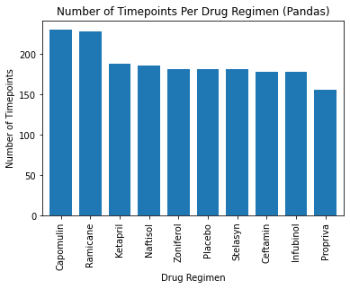
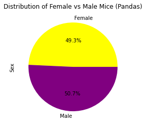
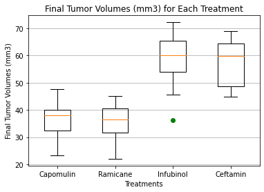
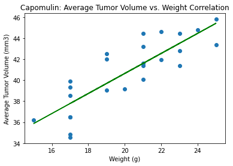

# matplotlib-challenge

By Grace Yoo

**Programming Languages and Libraries Used:** Python, Matplotlib, Pandas, Scipy, Jupyter Notebook

# Description

This toy dataset contains the results of a study wherein 249 mice with squamous cell carcinoma (SCC) were treated with different drugs over a course of 45 days. This study measures the size of a tumor volume over time. 

The purpose of this project is to visualize the effectiveness of different drug regimens for squamous cell carcinoma (SCC) by measuring tumor development over 45 days of treatment.

# Steps Taken

1. Combine mouse metadata and study results into a dataframe. 
2. Generate summary statistics (mean, median, variance, std dv, SEM) for the tumor volume for each drug. 
3. Generate a bar chart showing the total number of timepoints for all mice tested.
4. Generate a pie chart comparing male vs female mice in the study. 
5. Calculate final tumor volume for the four most promising treatments, and generate a box plot for each treatment. 
6. Generate a line plot and scatter plot comparing mouse weight to tumor volume for Capomulin. 
7. Calculate correlation coefficient and linear regression model of scatter plot. 

# Results

## Total Timepoints Per Drug Regimen

## Male vs Female Mice

## Top Four Treatment Final Tumor Volumes Boxplot

## Mouse Weight vs Tumor Volume for Capomulin Drug Regimen

